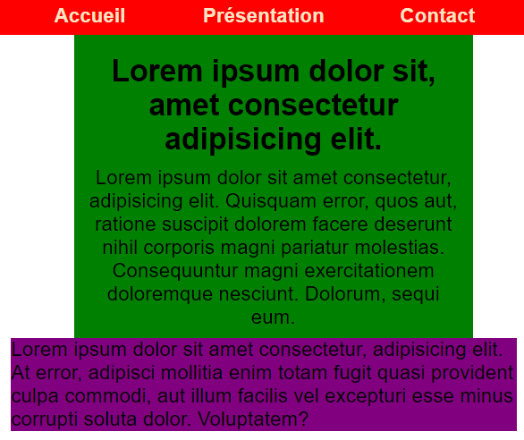
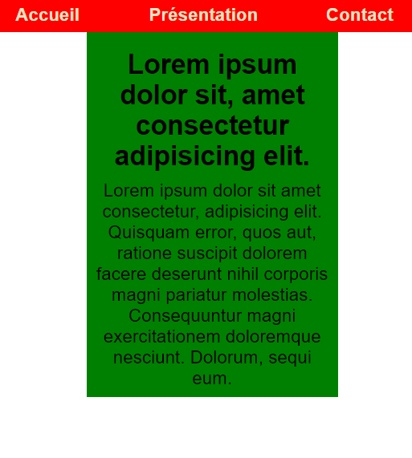

# Exercice Grille Flexible avec Flexbox - [👤](https://dwaps.fr)

**Rappel de la consigne:**

Créer un système de grille adaptable sur 12 colonnes avec flexbox.

Nota bene: Sans utiliser les `grid` en CSS, le système de grille sera forcément limité (à moins de le coupler avec du JS).

---

## Description

Le système comprend un ensemble de classe:

**grid** > initialise un container en tant que grille.<br>
**row** > initialise un sous conteneur en tant que ligne.<br>
**col-\*** > permet de déclarer une colonne (le signe `*` est à remplacer par un nombre compris entre 1 et 12).<br>
**col-offset-\*** > permet de décaler un élément de x colonnes (le signe `*`est à remplacer par un nombre compris entre 1 et 11).<br>
**hidden-\*** > permet de cacher un élément en fonction de la taille d'écran (le signe `*` est à remplacer par une des `sm`, `md`, `lg`, `xl`).

### Exemple:

```html
<div class="grid">
  <header class="row">
    <nav class="col-12">...</nav>
  </header>
  <main class="row">
    <section class="col-6 col-offset-3">...</section>
    <aside class="col-8 col-offset-2 hidden-sm">...</aside>
  </main>
</div>
```

### Rendu:

> MD SCREEN
> 

> SM SCREEN
> 

---

## Remarques additionnelles

J'ai ajouté un bouton de débogage en bas de page, permettant de faire simplement apparaître la grille.

Comme le système est assez limité, et qu'une `row` ne peut accueillir que 12 colonnes pour respecter le principe de la grille en douze, si des éléments HTML dépasse le nombre de colonnes autorisées ils seront automatiquement cachés.

## Limitations

- Un document HTML ne doit contenir qu'une seule grille.
- Il n'est pas possible de faire de l'imbrication de ligne ou de colonnes dans cette version du projet.
